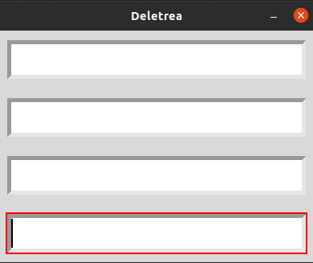
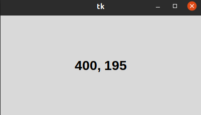
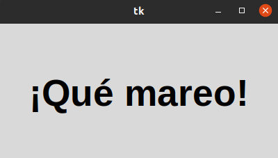

# 1. POSICIONAMIENTO Y DISEÑO

##  Metodo comun foco

### con Este deletreador mientras va bajando la barra tiene que colocar la letra o palabra en todoslos espacios y asi podras superar la prueba.

## Metodo comun raton

#### Con este metodo comun llamado raton cuando acercas el mause asi sea lento o raido cuenta cuanta la velocidad llevas.

## metodo comun temporizador

#### Este hace cuando esta pequeño la frace va umentando el tamaño y se va repitiendo el procedimiento.

